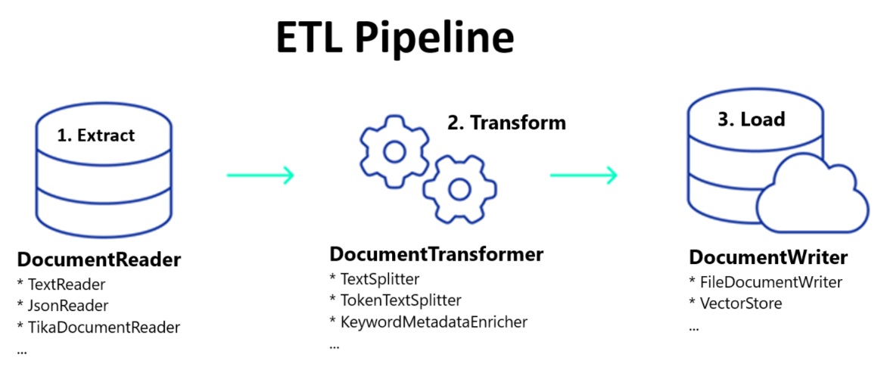

# ETL-Pipeline
Creating a pipeline that preform an ETL process on json files
## 📝 Table of Contents
- [System Architecture](#-system-architecture)
- [Setup & Requirements](#-setup--requirements)
- [Usage](#-usage)
- [Features](#-features)
- [Link to Project Colab Link](#-link-to-project-colab-link)

## ✨ System Architecture

## 🛠 Setup & Requirements
1. **Google Account**: Ensure you have an Google account to sign in Google Colab Enviroment.
2. **Python Libraries**: Install & Import the required Python libraries:
    - random
    - re
    - iglob
    - pipe, compose
    - csv
    - os
    - shutil
    - drive
    - json
    - string

## 🚀 Usage
Creating a pipeline that reads json files containing low quality data and then clean them and finally save them as CSV files on the drive in order to preform EXTRACT, TRANSFORM and LOAD process using a pipeline

## 📈 Features
- **System Architecture**: The pipeline is set up in order to preform ETL process on Python Enviroment.
- **Data Creating**: The script creates 10 JSON files each has a key as id number with punctuation sign and a value as a name with also punctuation sign.
- **Data Ingestion**: The script reads the JSON files containing the low quality data.
- **Data Cleaning**: The script standardizes files content, and corrects the Key and Value of JSON files by removing any punctuation.
- **Data Transformation**: the script changes the new cleaned files to csv format instead of json format.
- **Data Loading**: the script saves the new csv files to the drive.

## 🔗 Link to Project Colab Link
https://colab.research.google.com/drive/1STtErZ1dwAxAdZW6KYt8rbnXGk5gTFh2?usp=sharing
